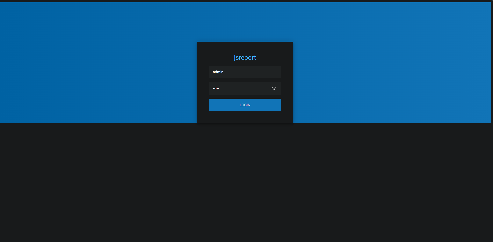
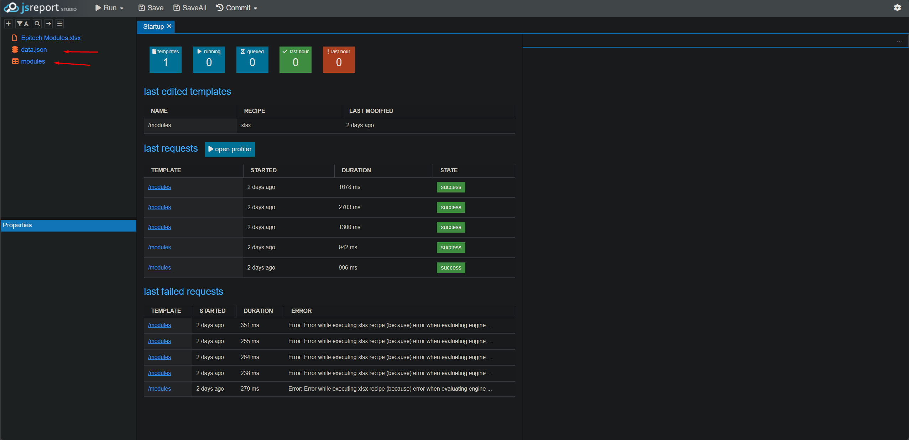
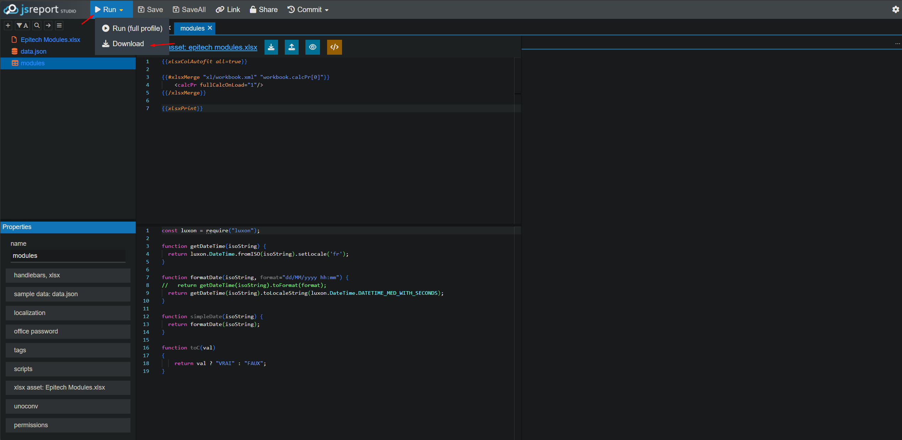
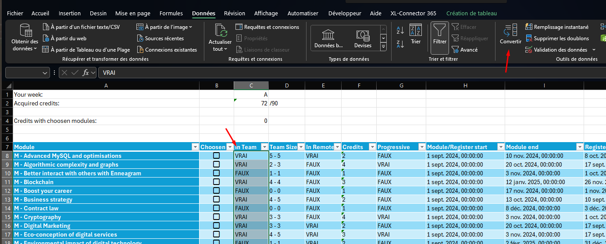

# Epitech Modules

Extract epitech modules to make an Excel with jsreport, and create a calendar with the modules.

## Usage

You will need to launch jsreport with docker compose, and replace the `data.json` of the template with the new data you made from `app` ([README.md](app/README.md)) folder.
You will need to rename `.env.example` to `.env` and change the username/password (or not).

```bash
docker compose up -d
```

You can login yourself using `admin/admin` if you didn't change the username/password in `.env`



When you are logged, you can create a new report with the template `modules` and, you will need to replace the `data.json`.
Simply double click on either the `data.json` or the `modules` template to open it.



When you are done, you can click on Run or Download, to create the Excel, you will need to open the `modules` template for that.



You will have your excel file, either at the right of the screen or in your download folder.

To fix the excel format for checkboxes and credits, you'll need to select the column and convert the data


