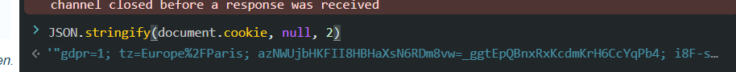
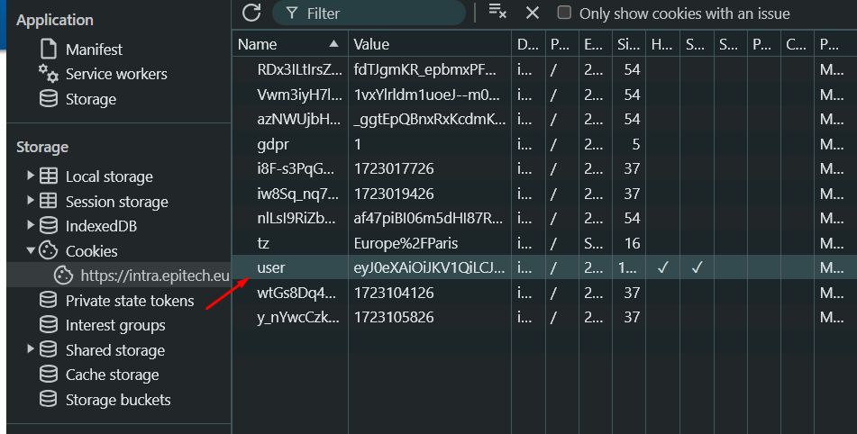

# App

NodeJS program that extract modules data from Epitech intranet.

## Usage

Rename the `.env.example` file to `.env` and fill the `INTRA_*` variables.

To get the `INTRA_ANTI_BOT_COOKIES` write this in the browser console, it will retrieve all cookies used for the anti bot.

```js
JSON.stringify(document.cookie, null, 2)
```



Then you need to get your user cookie in the developer tools, application tab, under cookies.



Get the JWT token and set it in the `.env` file.

```env
INTRA_TOKEN=ey...
```

Now you can install the dependencies using `pnpm install` and run the program using `pnpm start`.
